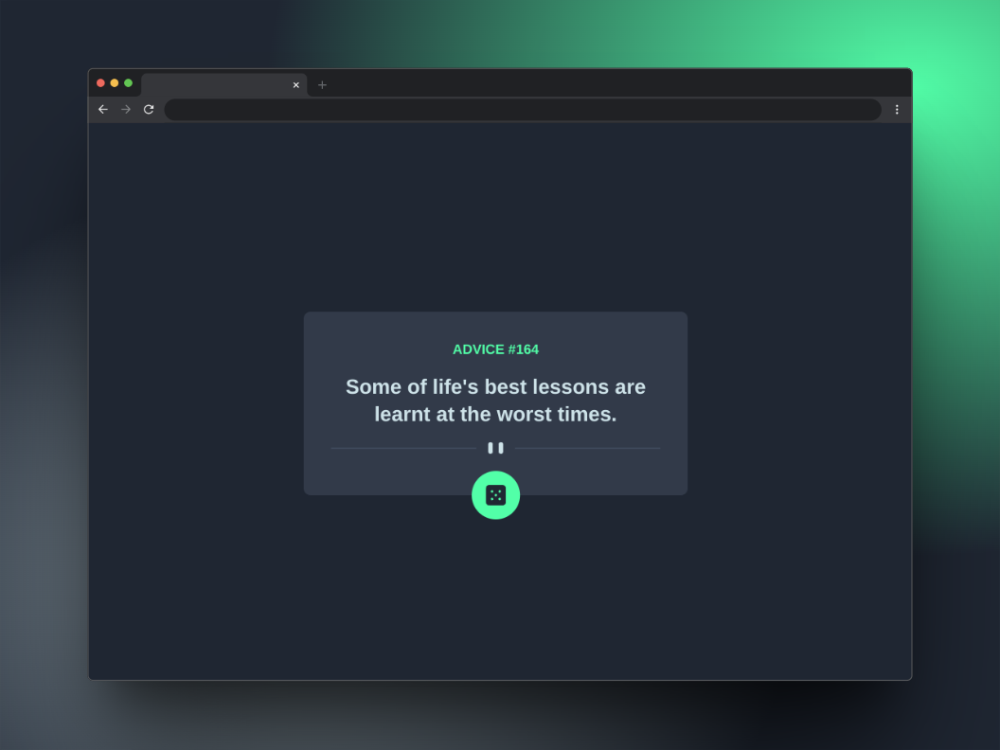

# Frontend Mentor - Advice generator app solution

This is a solution to the [Advice generator app challenge on Frontend Mentor](https://www.frontendmentor.io/challenges/advice-generator-app-QdUG-13db). Frontend Mentor challenges help you improve your coding skills by building realistic projects.

## Table of contents

- [Overview](#overview)
  - [The challenge](#the-challenge)
  - [Screenshot](#screenshot)
  - [Links](#links)
- [My process](#my-process)
  - [Built with](#built-with)
  - [What I learned](#what-i-learned)
- [Author](#author)

## Overview

### The challenge

Users should be able to:

- View the optimal layout for the app depending on their device's screen size
- See hover states for all interactive elements on the page
- Generate a new piece of advice by clicking the dice icon

### Screenshot



### Links

- Live Site URL: [https://julianngabrieldev.github.io/fm-advice-generator-app/](https://julianngabrieldev.github.io/fm-advice-generator-app/)

## My process

### Built with

- Semantic HTML5 markup
- CSS custom properties
- Flexbox
- CSS Grid
- Mobile-first workflow
- [React](https://reactjs.org/) - JS library
- [Tailwind CSS](https://tailwindcss.com/) - CSS framework

### What I learned

As a programming student who had only worked with JavaScript before, using TypeScript for this project was a good experience. I understood the benefits of static typing, which significantly improved code readability and helped prevent bugs. I learned how to use type annotations, declare variables, functions and interfaces with specific types.

```js
// Card.tsx
interface Slip {
    id: number;
    advice: string;
}

interface ApiResponse {
    slip: Slip;
}

const Card: FC = (): JSX.Element => {
    const [data, setData] = useState<ApiResponse | null>(null);
    const [loading, setLoading] = useState<boolean>(true);
    const [error, setError] = useState<Error | null>(null);

    /* ... */
}
```

## Author

- Julián Alejandro Gabriel Isidro
- Frontend Mentor - [@juliannGabrielDev](https://www.frontendmentor.io/profile/juliannGabrielDev)